# 🛡️ Awesome SaaS Security & Application Connectivity

<p align="center">
  
</p>

<p align="center">
  <a href="https://github.com/ishandutta2007/Awesome-Awesome-Awesome"></a><a href="https://discord.gg/jc4xtF58Ve"></a>
  
  
  <a href="https://github.com/ishandutta2007"></a>
</p>

---

## 📌 Executive Summary & Key Highlights

Welcome to the **Curated Ecosystem of SaaS Security, SaaS Posture Management (SSPM), Application Connectivity & Open-Source Identity Platforms**.

This repository serves as an enterprise-grade guide tracking both **commercial SaaS security platforms** and **open-source security tools** designed to:
- 🔍 **Discover & Audit Shadow IT**: Find unapproved SaaS tools, OAuth applications, and AI integrations across enterprise networks.
- 🔐 **Govern Identity & Access**: Manage Single Sign-On (SSO), Multi-Factor Authentication (MFA), role-based access control (RBAC), and fine-grained authorization (Zanzibar-inspired models).
- ⚙️ **Automate SaaS Security Workflows**: Enable SaaS-to-SaaS automation, API integration pipelines, and posture remediation without custom scripting.
- 📊 **Monitor SaaS Posture & Misconfigurations**: Continuously assess SaaS configurations, compliance status, and log security events in real time.

---

## 📑 Table of Contents

- [☁️ Commercial SaaS / Hosted Platforms](#-commercial-saas--hosted-platforms)
- [🔓 Open-Source GitHub Projects](#-open-source-github-projects)
  - [🔑 Identity & Access Management (IAM)](#-identity--access-management-iam)
  - [🛡️ Authorization & Policy Enforcement](#-authorization--policy-enforcement)
  - [🔎 SaaS Security Posture & Logging](#-saas-security-posture--logging)
  - [⚡ SaaS Connectivity & Integration Automation](#-saas-connectivity--integration-automation)
  - [🌐 Log Aggregation & Observability Pipelines](#-log-aggregation--observability-pipelines)
- [💡 Architectural Blueprint: Open-Source SSPM Stack](#-architectural-blueprint-open-source-sspm-stack)
- [🤝 How to Contribute](#-how-to-contribute)
- [❤️ Support & Sponsorship](#%EF%B8%8F-support--sponsorship)
- [⚠️ Disclaimer & Security Guidance](#%EF%B8%8F-disclaimer--security-guidance)
- [⭐ Star History](#-star-history)

---

## ☁️ Commercial SaaS / Hosted Platforms

> **📊 Market Overview**: The SaaS Security & Posture Management (SSPM) market is estimated at **$17.4 Billion (broader SaaS Security)** to **$640 Million (dedicated SSPM)** in 2025/2026. The sector is **moderately fragmented** (the top 5 companies control ~46% market share, with specialized vendors addressing emerging security needs alongside ongoing M&A consolidation).

| Platform | Description & Key Use Case | Size (Revenue / Valuation) | Pricing | Free Tier / Trial Limits |
| :--- | :--- | :--- | :--- | :--- |
| **[AWS AppFabric](https://aws.amazon.com/appfabric/)** | **AWS's SaaS application integration service** — connects SaaS apps for unified security and productivity insights. Normalizes audit logs from SaaS applications into OCSF format. *Best for AWS-centric SaaS security*. | **$105+ Billion ARR** (AWS Parent Revenue) | **$3.00 per user/month** (for first 30 connected SaaS apps) | **30-day Free Trial** (first 2 connected applications at $0 charge) |
| **[Obsidian Security](https://www.obsidiansecurity.com/)** | **SaaS security posture management** — threat detection and compliance for SaaS. *Best for enterprise SaaS security*. | **$1.1 Billion Valuation** ($85M Series D) | **~$12.00 per user/year** (custom enterprise quote starting ~$30,000/yr) | **30-day Free Trial** (available upon request/assessment) |
| **[Adaptive Shield](https://www.adaptiveshield.com/)** | **SaaS security posture management** — misconfiguration detection and remediation. *Best for SSPM*. | **$300 Million Valuation** (Acquired by CrowdStrike) | **~$7,500/year** (per block of 100 users on AWS Marketplace) | **14-day Free Trial** (via CrowdStrike Falcon platform integration) |
| **[BetterCloud](https://www.bettercloud.com/)** | **SaaS operations platform** — automation and security for SaaS applications. *Best for SaaS workflow automation*. | **$67 Million ARR** ($132M total funding) | **$1.00 per user/month** (starting rate for entry-tier spend optimization) | **Free Forever Tier** ($0/mo for Spend Optimization Basic up to 10 contracts) / **30-day Trial** |
| **[Grip Security](https://www.grip.security/)** | **SaaS identity and access management** — discovery and governance for SaaS apps. *Best for SaaS identity governance*. | **$66 Million Funding** (~$250M Valuation est.) | **~$25,000/year** (starting custom enterprise quote) | **5-day Proof of Concept (POC)** (surfaces full SaaS/AI risk footprint) |
| **[DoControl](https://www.docontrol.io/)** | **SaaS security platform** — data access governance, threat detection, and automated remediation. *Best for SaaS data protection*. | **$48.4 Million Funding** (~$10.8M ARR est.) | **~$30,000/year** (starting quote for 500 users / core apps) | **Free Risk Assessment (FRA)** (Instant automated Google Workspace/SaaS scan) |
| **[AppOmni](https://appomni.com/)** | **SaaS security posture management (SSPM)** — continuous monitoring and configuration assessment. *Best for enterprise SaaS security*. | **$35.7 Million ARR** ($123M total funding) | **$7,500/year per block of 100 users** (AWS Marketplace rate) | **90-day Free Trial** ("Foundations" SaaS discovery & identity package) |
| **[Torii](https://www.toriihq.com/)** | **SaaS management platform** — discovery, management, and optimization of SaaS applications. *Best for SaaS spend and security*. | **$35 Million Funding** (~$15M ARR est.) | **~$15,000/year** (starter enterprise tier based on employee count) | **14-day Free Trial** (full features & automated SaaS discovery) |
| **[Lumos](https://www.lumos.com/)** | **SaaS identity and access management** — app discovery, access reviews, and automated provisioning. *Best for SaaS access governance*. | **$30 Million Funding** (~$10M ARR est.) | **$27,000/year base rate** + ~$180/user/year (AWS Marketplace pricing) | **Free Interactive Demo** (no open self-service free trial) |
| **[Wing Security](https://www.wing.security/)** | **SaaS security platform** — discovery, posture management, and shadow IT detection. *Best for SaaS security automation*. | **$26 Million Funding** (~$3.7M ARR est.) | **~$10,000/year** (starting tier for continuous response features) | **Free Forever Tier** (Free SaaS discovery & posture check for up to 100 SaaS apps) |

---

## 🔓 Open-Source GitHub Projects

Sorted by **GitHub Stars_Count (Descending)**.

### 🔑 Identity & Access Management (IAM)

- **[Keycloak](https://github.com/keycloak/keycloak)** [](https://github.com/keycloak/keycloak/stargazers)  
  **The leading open-source identity provider**, Apache-2.0 licensed. **SSO, MFA, identity brokering, and user federation**. *The identity foundation for SaaS SSO* — supports OAuth 2.0, OIDC, and SAML. *Best for SaaS identity integration*.

- **[Authentik](https://github.com/goauthentik/authentik)** [](https://github.com/goauthentik/authentik/stargazers)  
  **Flexible open-source identity provider**, MIT/GPL licensed. **OAuth2, SAML, LDAP, and proxy support**. *Flow-based authentication customization*. *Best for SaaS SSO with customization*.

- **[Zitadel](https://github.com/zitadel/zitadel)** [](https://github.com/zitadel/zitadel/stargazers)  
  **Identity infrastructure with multi-tenancy and API-first design**, Apache-2.0 licensed. **OIDC, OAuth2, SAML2, passkeys/FIDO2, and SCIM 2.0**. *Best for modern SaaS identity*.

- **[Authelia](https://github.com/authelia/authelia)** [](https://github.com/authelia/authelia/stargazers)  
  **Open-source authentication and authorization server**, Apache-2.0 licensed. 2FA/MFA security layer for web applications and reverse proxies. *Best for lightweight access control*.

- **[Ory Kratos / Hydra](https://github.com/ory)** [](https://github.com/ory/kratos/stargazers)  
  **Modular open-source identity infrastructure**, Apache-2.0 licensed. Headless identity, user management, and OAuth2/OIDC server suite for cloud applications. *Best for API-first SaaS identity*.

---

### 🛡️ Authorization & Policy Enforcement

- **[Open Policy Agent (OPA)](https://github.com/open-policy-agent/opa)** [](https://github.com/open-policy-agent/opa/stargazers)  
  **General-purpose policy engine (CNCF Graduated)**, Apache-2.0 licensed. Unified policy enforcement across SaaS, microservices, and CI/CD pipelines. *Best for policy-as-code*.

- **[Casbin](https://github.com/casbin/casbin)** [](https://github.com/casbin/casbin/stargazers)  
  **Open-source authorization library**, Apache-2.0 licensed. Supports ACL, RBAC, and ABAC models for multi-tenant SaaS. *Best for embedded SaaS authorization*.

- **[SpiceDB](https://github.com/authzed/spicedb)** [](https://github.com/authzed/spicedb/stargazers)  
  **Google Zanzibar-inspired authorization database**, Apache-2.0 licensed. High-performance relationship-based access control (ReBAC). *Best for multi-tenant SaaS permissions*.

- **[OpenFGA](https://github.com/openfga/openfga)** [](https://github.com/openfga/openfga/stargazers)  
  **CNCF Sandbox fine-grained authorization engine**, Apache-2.0 licensed. Created by Auth0/Okta, implementing Zanzibar model for relationship access control. *Best for scalable SaaS access control*.

- **[Permify](https://github.com/Permify/permify)** [](https://github.com/Permify/permify/stargazers)  
  **Open-source authorization service**, Apache-2.0 licensed. Fine-grained permissions for multi-tenant SaaS apps using ReBAC. *Best for developer-friendly permissions*.

- **[Cerbos](https://github.com/cerbos/cerbos)** [](https://github.com/cerbos/cerbos/stargazers)  
  **Stateless policy-as-code authorization service**, Apache-2.0 licensed. Context-aware context evaluation for microservices and SaaS APIs. *Best for decoupled access control*.

- **[Oso](https://github.com/osohq/oso)** [](https://github.com/osohq/oso/stargazers)  
  **Open-source authorization framework**, Apache-2.0 licensed. Uses Polar language for declarative policy definition in application code. *Best for embedded logic*.

---

### 🔎 SaaS Security Posture & Logging

- **[OpenSearch](https://github.com/opensearch-project/OpenSearch)** [](https://github.com/opensearch-project/OpenSearch/stargazers)  
  **Open-source search & security analytics suite**, Apache-2.0 licensed. Ingests and analyzes audit logs from SaaS apps and cloud platforms. *Best for audit log analytics*.

- **[Wazuh](https://github.com/wazuh/wazuh)** [](https://github.com/wazuh/wazuh/stargazers)  
  **Open-source security platform (SIEM & XDR)**, GPLv2 licensed. Features threat detection, compliance auditing (PCI-DSS, GDPR, NIST), and log monitoring. *Best for security monitoring*.

- **[DefectDojo](https://github.com/DefectDojo/django-DefectDojo)** [](https://github.com/DefectDojo/django-DefectDojo/stargazers)  
  **OWASP DevSecOps vulnerability management platform**, Apache-2.0 licensed. Aggregates findings from 200+ security tools. *Best for security posture aggregation*.

- **[Steampipe](https://github.com/turbot/steampipe)** [](https://github.com/turbot/steampipe/stargazers)  
  **Zero-ETL SQL engine for cloud APIs**, AGPL-3.0 licensed. Query SaaS services (Slack, GitHub, AWS, Workspace) using standard SQL. *Best for SaaS posture assessment*.

- **[CloudQuery](https://github.com/cloudquery/cloudquery)** [](https://github.com/cloudquery/cloudquery/stargazers)  
  **Open-source cloud & SaaS asset inventory platform**, MPL-2.0 licensed. Extracts and normalizes SaaS configurations into SQL databases. *Best for SaaS asset visibility*.

- **[Pomerium](https://github.com/pomerium/pomerium)** [](https://github.com/pomerium/pomerium/stargazers)  
  **Identity-aware access proxy**, Apache-2.0 licensed. Provides context-aware Zero Trust Access to internal and SaaS applications. *Best for Zero Trust ZTNA*.

---

### ⚡ SaaS Connectivity & Integration Automation

- **[n8n](https://github.com/n8n-io/n8n)** [](https://github.com/n8n-io/n8n/stargazers)  
  **Workflow automation platform**, Sustainable Use License. Offers 400+ native integrations for SaaS-to-SaaS connectivity and event triggering. *Best for workflow automation*.

- **[Apache Airflow](https://github.com/apache/airflow)** [](https://github.com/apache/airflow/stargazers)  
  **Programmatic workflow orchestration standard**, Apache-2.0 licensed. Python-based DAG engine for complex SaaS integration pipelines. *Best for data workflow orchestration*.

- **[Activepieces](https://github.com/activepieces/activepieces)** [](https://github.com/activepieces/activepieces/stargazers)  
  **MIT-licensed AI-native automation platform**, MIT licensed. 200+ integrations with full Model Context Protocol (MCP) server support. *Best for open-source automation*.

- **[Node-RED](https://github.com/node-red/node-red)** [](https://github.com/node-red/node-red/stargazers)  
  **Flow-based visual programming editor**, Apache-2.0 licensed. Integrates hardware devices, APIs, and SaaS webhooks. *Best for visual API integration*.

- **[Windmill](https://github.com/windmill-labs/windmill)** [](https://github.com/windmill-labs/windmill/stargazers)  
  **Developer-first workflow engine**, AGPLv3 licensed. Turn Python, TypeScript, Go, or SQL scripts into automated workflows and internal applications. *Best for developer automation*.

- **[Kestra](https://github.com/kestra-io/kestra)** [](https://github.com/kestra-io/kestra/stargazers)  
  **Declarative event-driven orchestrator**, Apache-2.0 licensed. YAML-based workflows for enterprise SaaS data pipeline integration. *Best for declarative orchestration*.

- **[Apache Camel](https://github.com/apache/camel)** [](https://github.com/apache/camel/stargazers)  
  **Enterprise integration pattern (EIP) framework**, Apache-2.0 licensed. Features 300+ connectors for legacy and SaaS protocols. *Best for enterprise integration*.

---

### 🌐 Log Aggregation & Observability Pipelines

- **[Fluentd](https://github.com/fluent/fluentd)** [](https://github.com/fluent/fluentd/stargazers)  
  **CNCF Graduated unified logging layer**, Apache-2.0 licensed. Ingests log streams from SaaS webhooks and security APIs. *Best for unified logging*.

- **[Vector](https://github.com/vectordotdev/vector)** [](https://github.com/vectordotdev/vector/stargazers)  
  **High-performance observability data pipeline**, MPL-2.0 licensed. Collects, transforms, and routes SaaS audit logs in Rust. *Best for high-throughput log routing*.

- **[Grafana Loki](https://github.com/grafana/loki)** [](https://github.com/grafana/loki/stargazers)  
  **Horizontally scalable log aggregation system**, AGPL-3.0 licensed. Optimized for indexing metadata of SaaS audit streams. *Best for cost-effective log storage*.

- **[Graylog](https://github.com/Graylog2/graylog2-server)** [](https://github.com/Graylog2/graylog2-server/stargazers)  
  **Centralized log management platform**, SSPL licensed. Real-time analysis of SaaS event logs. *Best for log management*.

- **[Redpanda Connect (Benthos)](https://github.com/redpanda-data/connect)** [](https://github.com/redpanda-data/connect/stargazers)  
  **Stream processing buffer engine**, Apache-2.0 licensed. Declarative payload mapping for SaaS webhooks and API payloads. *Best for lightweight stream processing*.

---

## 💡 Architectural Blueprint: Open-Source SSPM Stack

Organizations seeking **SaaS security sovereignty** can build a self-hosted SaaS security stack by combining these open-source building blocks:

```
  ┌────────────────────────────────────────────────────────────────────────┐
  │                           SaaS Ecosystem                               │
  │     (Google Workspace, Microsoft 365, Salesforce, GitHub, Slack)       │
  └───────────────────────────────────┬────────────────────────────────────┘
                                      │ Log Audit Streams / API Sync
                                      ▼
  ┌────────────────────────────────────────────────────────────────────────┐
  │                 1. ASSET DISCOVERY & AUDIT LAYER                       │
  │     - CloudQuery / Steampipe (SaaS Config SQL Normalization)          │
  │     - Vector / Fluentd (Real-time Audit Log Pipeline)                  │
  └───────────────────────────────────┬────────────────────────────────────┘
                                      │
                                      ▼
  ┌────────────────────────────────────────────────────────────────────────┐
  │               2. IDENTITY & AUTHORIZATION FOUNDATION                   │
  │     - Keycloak / Authentik (Unified SaaS SSO & SCIM Provisioning)      │
  │     - OPA / SpiceDB / Casbin (Policy Enforcement & Fine-Grained ReBAC) │
  └───────────────────────────────────┬────────────────────────────────────┘
                                      │
                                      ▼
  ┌────────────────────────────────────────────────────────────────────────┐
  │             3. SIEM, OBSERVABILITY & REMEDIATION LAYER                 │
  │     - OpenSearch / Wazuh / Loki (Log Analysis & Posture Monitoring)    │
  │     - n8n / Activepieces / Windmill (Automated Remediation Workflows)  │
  └────────────────────────────────────────────────────────────────────────┘
```

> **📌 Operational Note**: Commercial platforms (AppOmni, Obsidian, Adaptive Shield) deliver turnkey out-of-the-box discovery and remediation workflows. The open-source stack offers complete data sovereignty and customization, requiring integration engineering across identity, policy, and workflow tools.

---

## 🤝 How to Contribute

Contributions are welcome! Please follow these simple guidelines:

1. 🍴 **Fork** this repository.
2. 📝 **Add/Update** entries in `README.md` maintaining alphabetical order or star ranking.
3. 📋 **Include**: Project Name, Official URL, License Type, Stars_Count badge (for open-source), and 1–2 sentence description.
4. 🚀 **Submit a Pull Request (PR)** with a clear summary of changes.

Check out our full list of curated tech resources at **[Awesome-Awesome-Awesome](https://github.com/ishandutta2007/Awesome-Awesome-Awesome)**.

---

## ❤️ Support & Sponsorship

If you find this repository valuable for your security posture, SaaS management, or architectural research, please consider supporting the project:

- ⭐ **Star** this repository to increase visibility!
- 🔀 **Fork** it to build your internal team documentation.
- 💬 **Share** with security engineers, DevOps, and IT admins.
- ☕ **Sponsor**: Support ongoing maintenance and research on our **[GitHub Sponsor Dashboard](https://github.com/sponsors/ishandutta2007)**.

Thank you for supporting open security standards and cloud transparency!

---

## ⚠️ Disclaimer & Security Guidance

- This repository is a **community-curated index** for informational and educational purposes. Inclusion does not imply official endorsement.
- **Security Hardening**: SaaS security and identity tools access sensitive credentials and production configurations. Self-hosted options (Keycloak, Wazuh, OpenSearch) require rigorous transport encryption, network isolation, and secret management.
- **Licensing Compliance**: Always review license terms before commercial deployment (e.g., AGPLv3 for Windmill, Sustainable Use License for n8n, SSPL for Graylog, Apache-2.0 for Keycloak/OPA).

---

## ⭐ Star History

[](https://star-history.dera.page/#ishandutta2007/Awesome-Saas-Security-Application-Connectivity&type=date&legend=top-left)

---

<p align="center">
  <b>Made for Security Engineers, CISOs, and SaaS Administrators worldwide.</b>
</p>
